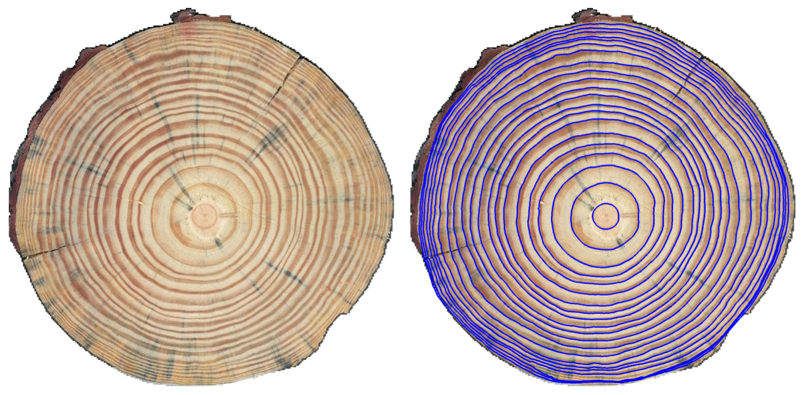
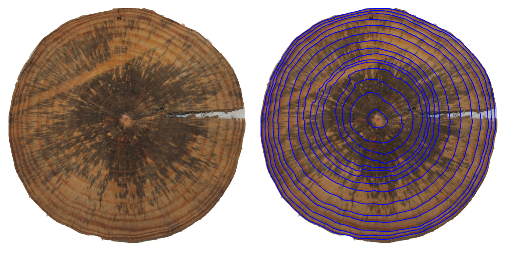
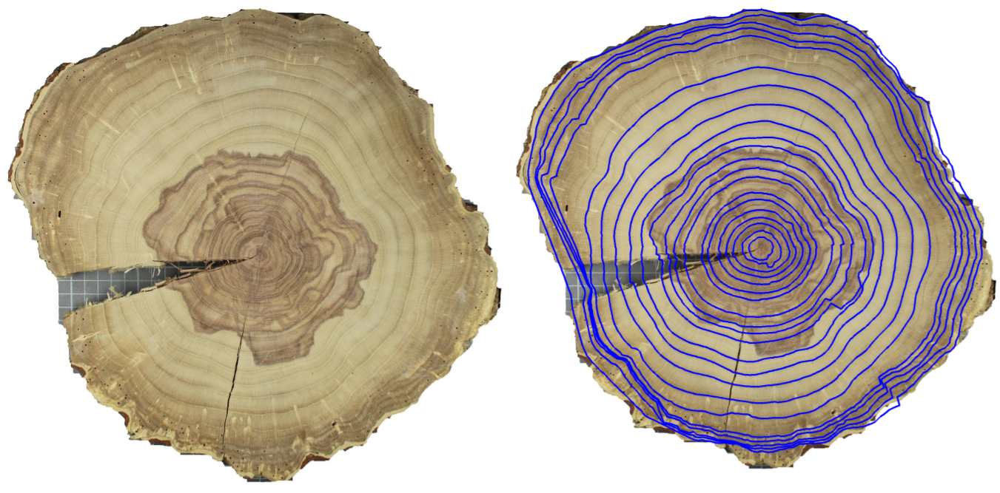

# DeepCS-TRD
DeepCS-TRD, a Deep Learning-based Cross-Section Tree Ring Detector in Macro images of Pinus taeda and Gleditsia triacanthos.
***
[](https://github.com/codespaces/new?skip_quickstart=true&machine=basicLinux32gb&repo=894688718&ref=main&devcontainer_path=.devcontainer%2Fdevcontainer.json&geo=UsEast)

Run app 
```bash
streamlit run app.py
```
***



***
## Local Setup:
### Set conda environment 
```bash
conda env create -f environment.yml
conda activate deep_cstrd
pip install -r requirements.txt
```

### Install dependencies
1) CS-TRD
```bash 
git clone https://github.com/hmarichal93/cstrd_ipol.git
cd cstrd_ipol/
pip install .
cd .. 
```
2) UruDendro
```bash
git clone https://github.com/hmarichal93/uruDendro.git
cd uruDendro/
pip install .
```

### Test
Results should appear in the output/F02c folder
```bash
python main.py inference
```

### Usage
```bash
python main.py inference --input input/F02c.png --cy 1264 --cx 1204  --output_dir ./output --root ./ --weights_path ./models/deep_cstrd/256_pinus_v1_1504.pth
```

## Train

```bash 
python main.py train --dataset_dir DATASET_PATH --logs_dir SAVE_DIR
```
Where DATASET_PATH is the path to the dataset folder containing the images and the annotations, and SAVE_DIR is the 
path to the directory where the models are going to be saved

Training can be monitored using tensorboard
```bash
tensorboard --logdir=SAVE_DIR
```

## Evaluate 

```bash 
python main.py evaluate --dataset_dir DATASET_PATH --results_path RESULT_PATH
```
Where DATASET_PATH is the path to the dataset folder containing the images and the annotations, 
and RESULT_PATH is the path to the directory where the results are going to be saved.

## More Examples 

***





***

