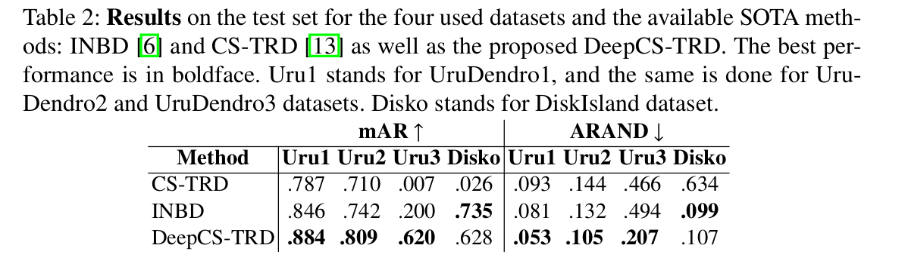
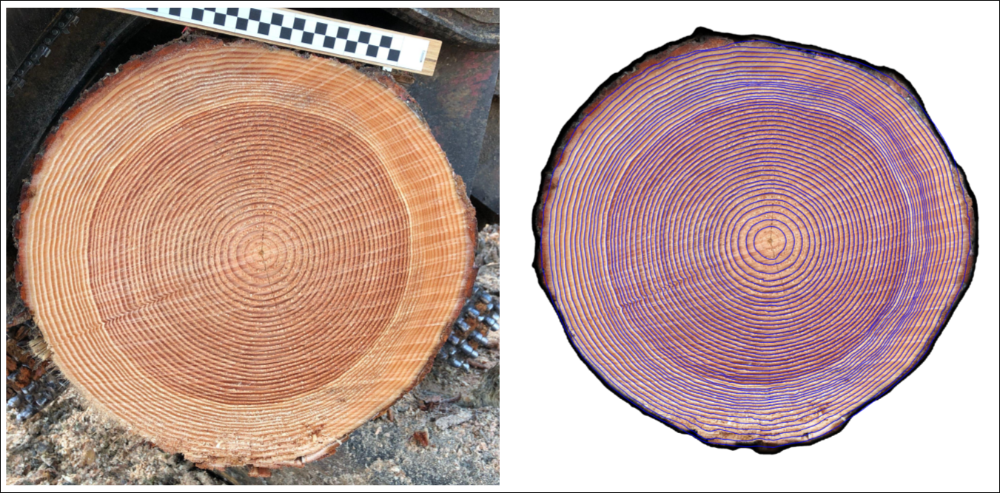
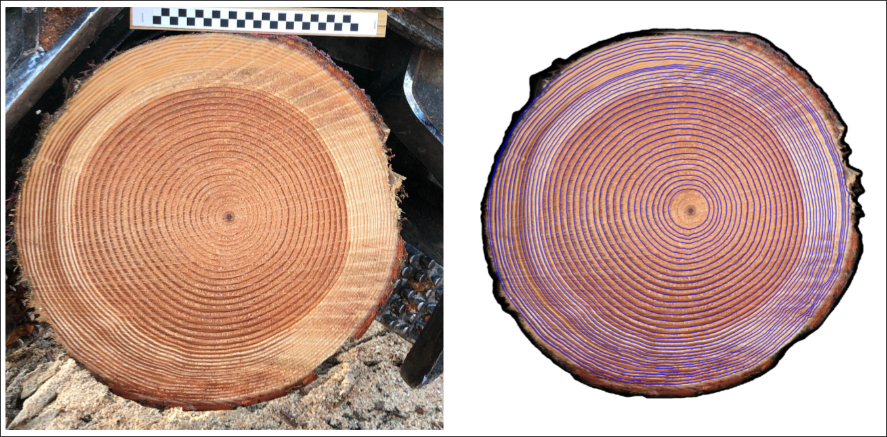
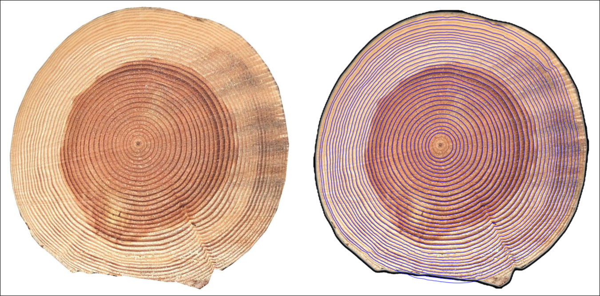
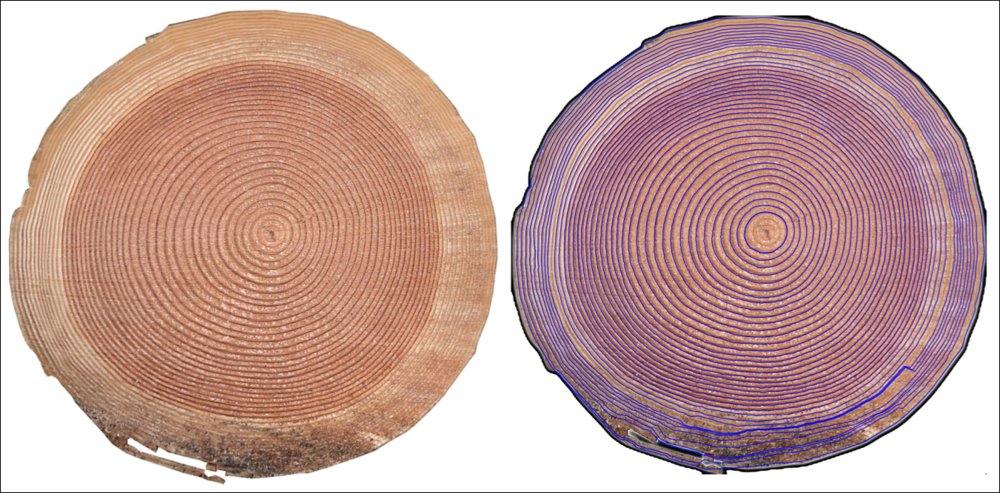
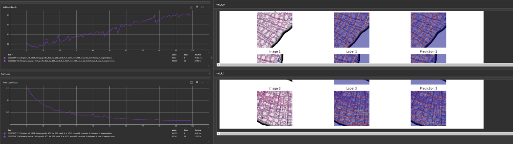

# DeepCS-TRD

**Accepted at International Conference on Image Analysis and Processing (ICIAP) 2025** [Arxiv](https://doi.org/10.48550/arXiv.2504.16242)

DeepCS-TRD, a Deep Learning-based Cross-Section Tree Ring Detector in Macro images. It substitutes the edge detection step of CS-TRD 
by a deep-learning-based approach (U-Net), which allows the application of the method to different image domains: microscopy, scanner or smartphone acquired, and species (Pinus taeda, Gleditsia triachantos and Salix glauca). In addition, two publicly available annotated datasets are introduced to the community. 
The proposed method outperforms state-of-the-art approaches in macro images (Pinus taeda and Gleditsia triacanthos) while showing slightly lower performance in microscopy images of Salix glauca. To our knowledge, this is the first work that studies automatic tree ring detection for such different species and acquisition conditions. Dataset is available [here](https://github.com/hmarichal93/deepcstrd/releases/tag/v1.0).

***


[](https://github.com/codespaces/new?skip_quickstart=true&machine=basicLinux32gb&repo=894688718&ref=main&devcontainer_path=.devcontainer%2Fdevcontainer.json&geo=UsEast)

Run app 
```bash
streamlit run app.py
```

***

<div style="text-align: center;">
    
</div>

***
Delineation of tree rings in the forest capturing images with a smartphone camera. Images from the [Douglas fir dataset](https://annforsci.biomedcentral.com/articles/10.1186/s13595-022-01163-7).


## More Examples 

***
<details><summary>Pinus taeda</summary>


</details>

<details><summary>Gleditsia triacanthos</summary>
</details>

<details><summary>Douglas fir (sawmill)</summary>




</details>

***
## Local Setup:
### Set conda environment 
```bash
conda env create -f environment.yml
conda activate deep_cstrd
apt-get install git-lfs
git lfs pull
python setup.py install
pip install -r requirements.txt
```

### Install dependencies
1) CS-TRD
```bash 
git clone https://github.com/hmarichal93/cstrd_ipol.git
cd cstrd_ipol/
python setup.py install
pip install -r requirements.txt
cd .. 
```
2) UruDendro
```bash
git clone https://github.com/hmarichal93/uruDendro.git
cd uruDendro/
python setup.py install
pip install -r requirements.txt
```

### Test
Results should appear in the output/F02c folder
```bash
python main.py inference
```

### Usage
```bash
python main.py inference --input input/F02c.png --cy 1264 --cx 1204  --output_dir ./output --root ./ --weights_path ./models/deep_cstrd/256_pinus_v1_1504.pth
```
### Automatic pith detector
Go to the [APD](https://github.com/hmarichal93/apd.git) repository and follow the instructions to install the automatic pith detector.

## Train

```bash 
python main.py train --dataset_dir DATASET_PATH --logs_dir SAVE_DIR
```
Where DATASET_PATH is the path to the dataset folder containing the images and the annotations, and SAVE_DIR is the 
path to the directory where the models are going to be saved

Training can be monitored using tensorboard
```bash
tensorboard --logdir=SAVE_DIR
```
<div style="text-align: center;">
    
</div>

Annotation were made using the [Labelme](https://github.com/wkentaro/labelme) tool marking tree ring boundaries as polylines.

## Evaluate 

```bash 
python main.py evaluate --dataset_dir DATASET_PATH --results_path RESULT_PATH
```
Where DATASET_PATH is the path to the dataset folder containing the images and the annotations, 
and RESULT_PATH is the path to the directory where the results are going to be saved.


***

